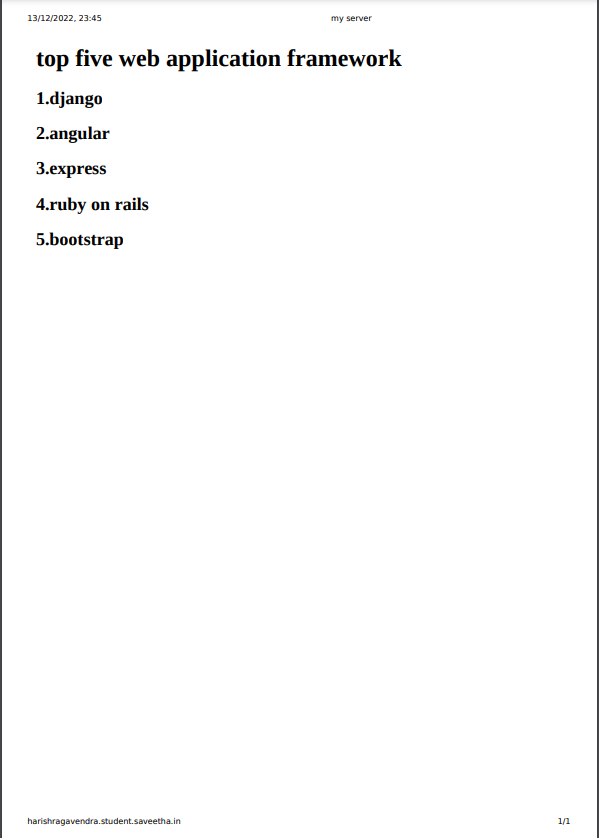

# Developing a Simple Webserver

# AIM:
Develop a webserver to display about top five web application development frameworks.


## DESIGN STEPS:

### Step 1:

HTML content creation is done

### Step 2:

Design of webserver workflow

### Step 3:

Implementation using Python code

### Step 4:

Serving the HTML pages.

### Step 5:

Testing the webserver

## PROGRAM:
```
from http.server import HTTPserver,BaseHTTPRequestHandler

content = """
<title>my webserver</title>
top five web application development frameworks.

    React js
    Django
    Node js
    Larvarel
    Angular JS

"""

class myhandler(BaseHTTPRequestHandler): def do_GET(self): print("request received") self.send_response(200) self.send_header('content-type','text/html; charset=utf-8') self.end_headers() self.wfile.write(content.encode()) server_address = ('',8000) httpd = HTTPServer(server_address,myhandler) print("my webserver is running...") httpd.serve_forever() #python3 simplewebserver.py 
```
# OUTPUT:

## RESULT:
The program is executed succesfully